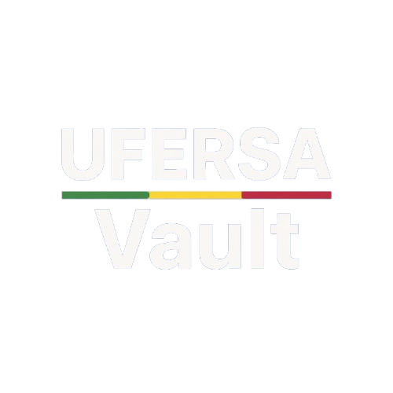

  
   
  
  
  
  

---

## 📖 Sobre o Projeto

O **Ufersa Vault** é uma plataforma colaborativa desenvolvida para a comunidade acadêmica da **Universidade Federal Rural do Semi-Árido (UFERSA)**. O objetivo principal é facilitar o compartilhamento e o acesso a materiais de estudo, como provas antigas, listas de exercícios, resumos e anotações de aula.

Com uma interface moderna e intuitiva, o sistema permite que alunos de diversos cursos (com foco inicial nos cursos de BTI, Eng. de Software e Computação) encontrem rapidamente o que precisam para seus estudos, promovendo a ajuda mútua e o fortalecimento do aprendizado coletivo.

## ✨ Funcionalidades Principais

*   **📂 Repositório Centralizado:** Acesso fácil a materiais organizados por disciplina, semestre e unidade.
*   **📤 Upload de Materiais:** Alunos podem contribuir enviando seus próprios materiais (PDFs, imagens, etc.).
*   **🔍 Busca Inteligente:** Filtros por disciplina, professor e tipo de material.
*   **⭐ Sistema de Votação:** A comunidade avalia a qualidade dos materiais (upvote/downvote), garantindo que os melhores conteúdos ganhem destaque.
*   **🔐 Autenticação Segura:** Integração com serviços de identidade para garantir a segurança e integridade da plataforma.

## 📸 Telas do Sistema

Confira abaixo algumas imagens da aplicação em funcionamento:

  <h3>Página Inicial e Listagem</h3>
  
    
  
  <h3>Modal de Upload</h3>
  
    

  <h3>Visualização Mobile</h3>
  

    
    
  

## 🛠️ Tecnologias Utilizadas

*   **Frontend:** React, Vite, CSS Modules / Styled Components
*   **Backend / Infraestrutura:** AWS (API Gateway, Lambda, S3, DynamoDB/RDS)
*   **Integração:** Axios para comunicação com APIs

## 🚀 Status do Projeto

✅ **Em Produção**

O sistema já está no ar e disponível para uso da comunidade acadêmica.

## 🔗 Acesso e Download

*   **🌐 Acesso Web:** [Acessar Ufersa Vault](https://vault.joaogustavo.grupo-03.sd.ufersa.dev.br)
*   **📱 Download do App (Android):** [Baixar APK](https://vault.joaogustavo.grupo-03.sd.ufersa.dev.br/ufersaVault.apk)

